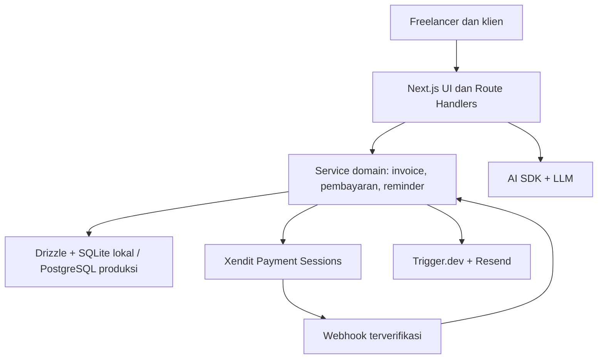

# SYSTEM.md — Asisten Keuangan AI untuk Freelancer

> Versi: 0.1 · 27 September 2026 · Status: blueprint MVP
>
> Pitch: **“Fokus kerja, urusan invoice dan tagihan biar AI yang tangani.”**

## 1. Tujuan produk

Aplikasi membantu freelancer membuat invoice, mengatur DP dan termin, menerima pembayaran, memantau piutang, serta mengingatkan klien lewat alur chat sederhana. Pemilik usaha tetap meninjau detail sebelum invoice atau pesan tagihan dikirim. Sasaran awal ialah freelancer dan solopreneur Indonesia yang menagih dalam rupiah.

**Hasil MVP yang harus bisa didemokan:** ketik instruksi → AI mengusulkan data terstruktur → freelancer mengoreksi dan mengonfirmasi → invoice serta jadwal DP/termin dibuat → klien membuka tautan publik dan membayar lewat hosted checkout Xendit sandbox → webhook memperbarui pembayaran → dashboard dan kuitansi ikut berubah.

### Batas MVP

| Masuk MVP | Tahap berikutnya |
| --- | --- |
| Landing page dengan demo parsing tanpa login; Google sign-in; profil freelancer; klien; invoice full/DP/termin; PDF; tautan invoice; Xendit sandbox; webhook; dashboard; pengingat email | Voice note, bot WhatsApp/Telegram dua arah, pengiriman WhatsApp otomatis, pajak lanjutan, multi mata uang, rekonsiliasi bank, pengeluaran, pembukuan akuntansi lengkap |

Demo publik hanya menghasilkan **preview**, tanpa menyimpan atau mengirim tagihan. Di mode produksi, label “preview” harus jelas agar contoh tidak tampak seperti transaksi nyata.

## 2. Stack yang disepakati

| Lapisan | Pilihan | Catatan |
| --- | --- | --- |
| Web dan API | Next.js App Router + TypeScript | Server Actions untuk aksi UI; Route Handlers untuk webhook dan endpoint publik. |
| UI | Tailwind CSS, shadcn/ui, Lucide React | Responsif untuk ponsel. |
| Grafik | Recharts melalui komponen chart shadcn/ui | Cukup untuk ringkasan bulanan. |
| Validasi | Zod; React Hook Form untuk form profil/koreksi | Validasi ulang di server; hasil LLM tidak dipercaya begitu saja. |
| AI | AI SDK + satu penyedia LLM yang dipilih saat implementasi | Structured output untuk intent; provider dan model lewat konfigurasi. |
| Data lokal | SQLite + Drizzle ORM | File lokal untuk development dan demo lokal. |
| Data produksi | Supabase PostgreSQL + Drizzle ORM | Migrasi schema dan data dilakukan eksplisit. |
| Login | Supabase Auth + Google OAuth | Supabase Auth dapat digunakan dari aplikasi lokal; hanya database bisnisnya yang SQLite selama development. |
| Pembayaran | Xendit Payment Sessions, mode `PAYMENT_LINK` | Hosted checkout; mulai dengan sandbox dan metode yang aktif pada akun. |
| PDF | `@react-pdf/renderer` | Menghasilkan invoice/kuitansi. Tambahkan PDF.js hanya jika viewer PDF khusus benar-benar diperlukan. |
| Job | Trigger.dev | Jadwal pengingat dan retry pengiriman; adapter job lokal/mock untuk demo tanpa layanan ini. |
| Email | Resend | Pengiriman invoice, pengingat, dan kuitansi. |
| WhatsApp | Meta WhatsApp Cloud API, fase berikutnya | Aktivasi, template, consent, dan biaya perlu dicek sebelum dipakai. |
| Tanggal | date-fns + timezone `Asia/Jakarta` | Simpan timestamp UTC; tampilkan tanggal dalam zona waktu pengguna. |
| Deployment | Vercel + Supabase | Jangan gunakan file SQLite lokal sebagai database deployment serverless. |

**Keputusan penting:** Drizzle memudahkan query dan model domain, tetapi `sqlite-core` dan `pg-core` memiliki definisi schema serta migrasi masing-masing. Jangan berasumsi SQL migrasi SQLite bisa langsung dijalankan di PostgreSQL. Pertahankan tipe domain dan aturan bisnis bersama; buat mapping dan migrasi per dialek.

## 3. Peran dan halaman

| Peran | Akses |
| --- | --- |
| Pengunjung | Landing page, demo parsing terbatas. |
| Freelancer | Profil, daftar klien, dashboard, chat perintah, draft, jadwal pembayaran, invoice, pengingat, transaksi. |
| Klien | Halaman invoice lewat token acak tanpa login, hosted checkout, unduh invoice/kuitansi yang sesuai. |
| Sistem | LLM, scheduler, email, webhook Xendit; tidak memiliki akses UI manusia. |

Rute usulan: `/`, `/login`, `/onboarding`, `/dashboard`, `/invoices`, `/invoices/new`, `/invoices/[id]`, `/clients`, `/settings`, `/i/[token]`, `/api/ai/parse`, `/api/webhooks/xendit`.

## 4. Alur utama

1. Freelancer masuk dengan Google dan melengkapi nama usaha, email pengirim, serta identitas pembayaran sesuai kebutuhan onboarding Xendit. Data rekening tidak dijadikan instruksi transfer manual bila checkout Xendit aktif.
2. Freelancer mengetik, misalnya: **“Tagihkan 1 juta ke Himatifa buat website, DP 30%, sisanya dua minggu.”**
3. Server meminta AI mengubah pesan menjadi proposal JSON. Jika “dua minggu” ambigu (sejak hari ini atau setelah DP/proyek selesai), UI meminta tanggal pasti. Nama klien, kontak, tanggal jatuh tempo, dan nilai wajib dilengkapi sebelum terbit.
4. UI menampilkan draft yang bisa diedit. Backend menghitung nominal: total Rp1.000.000, DP Rp300.000, sisa Rp700.000. AI tidak menghitung nilai final dan tidak boleh menerbitkan invoice sendiri.
5. Setelah konfirmasi, backend menyimpan invoice induk dan dua tagihan termin. Setiap termin yang siap dibayar memiliki satu checkout Xendit tersendiri sebesar nominal termin itu; tautan pembayaran dibuat server-side.
6. Sistem mengirim invoice setelah pengguna menekan **Kirim**. Klien membuka `/i/[token]`, melihat rincian dan menekan **Bayar** untuk menuju checkout Xendit. QRIS/VA ditampilkan oleh checkout sesuai metode yang tersedia; jangan membuat QRIS sendiri dari nomor rekening.
7. Webhook terverifikasi mencatat pembayaran pada termin yang sesuai. Ketika DP lunas, invoice induk menjadi `partially_paid`; ketika semua termin lunas, `paid`. Kuitansi untuk pembayaran yang sukses dikirim sekali.
8. Job pengingat membaca termin yang masih perlu dibayar, memeriksa aturan pengiriman, lalu mengirim email pada H-3, H-1, H, H+3, dan H+7. Job membatalkan pengingat apabila status telah lunas/batal sebelum eksekusi.

### Aturan full, DP, dan termin

- `full`: satu termin 100%.
- `dp`: DP dan satu termin pelunasan; persentase DP 1–99, total termin **harus sama** dengan total invoice. Tanggal pelunasan harus konkret; milestone manual boleh diset setelah proyek selesai.
- `installment`: dua termin atau lebih, masing-masing nominal dan due date. UI menolak total termin yang tidak cocok.
- Nominal disimpan sebagai **integer rupiah** (IDR tanpa pecahan). Semua perhitungan dilakukan di backend dengan pembulatan eksplisit; selisih pembulatan diberikan ke termin terakhir.
- Invoice induk mengikat kontrak/tagihan keseluruhan; tiap termin punya nomor dan status sendiri. Jangan menerbitkan ulang nomor invoice setelah final.

## 5. Arsitektur komponen



Lapisan domain menangani invoice, total termin, hak akses, dan status pembayaran. Handler HTTP, AI, Xendit, serta scheduler memanggil domain service yang sama. Integrasi eksternal dibungkus adapter agar bisa memakai fake adapter di demo lokal tanpa mengubah logika invoice.

### Struktur folder usulan

```text
src/app/                 # halaman dan route handler Next.js
src/components/          # UI, form, chart, invoice preview
src/features/ai/         # schema intent, prompt, parser
src/features/invoices/   # aturan invoice dan termin
src/features/payments/   # Xendit adapter, webhook, status
src/features/reminders/  # kebijakan jadwal dan template
src/db/sqlite/            # schema dan migrations SQLite
src/db/postgres/          # schema dan migrations PostgreSQL
src/db/repositories/      # antarmuka akses data
src/lib/auth/             # Supabase Auth + otorisasi user
src/lib/pdf/              # template invoice dan kuitansi
```

## 6. Model data minimum

Semua tabel bisnis memiliki `owner_user_id` dan aksesnya selalu dibatasi ke pemilik. `users.id` memakai UUID dari Supabase Auth; data profil aplikasi disimpan terpisah dari identitas auth.

| Tabel | Field penting | Aturan |
| --- | --- | --- |
| `profiles` | `user_id`, `brand_name`, `contact_email`, `timezone`, `onboarded_at` | Satu profil per user. |
| `clients` | `id`, `owner_user_id`, `name`, `email`, `phone`, `created_at` | Kontak untuk pengiriman harus divalidasi. |
| `invoices` | `id`, `owner_user_id`, `client_id`, `number`, `title`, `currency`, `total_amount`, `scheme`, `status`, `issued_at`, `public_token_hash`, `cancelled_at` | Nomor unik per pemilik; token publik acak, tidak dari nama klien. |
| `invoice_items` | `id`, `invoice_id`, `description`, `quantity`, `unit_amount`, `line_total` | Total item cocok dengan total invoice. |
| `installments` | `id`, `invoice_id`, `sequence`, `label`, `amount`, `due_at`, `status`, `paid_amount` | Jumlah seluruh termin = total invoice. |
| `checkout_sessions` | `id`, `installment_id`, `provider`, `external_reference`, `provider_session_id`, `payment_link_url`, `expires_at`, `status` | Simpan satu referensi internal unik; link dapat diganti jika kedaluwarsa. |
| `payments` | `id`, `installment_id`, `provider_payment_id`, `amount`, `currency`, `status`, `paid_at`, `raw_event_id` | `provider_payment_id` unik bila tersedia; jangan mencatat duplikat. |
| `webhook_events` | `id`, `provider`, `event_key`, `event_type`, `received_at`, `processed_at`, `status` | Kunci deduplikasi unik; simpan payload minimum yang diperlukan. |
| `reminders` | `id`, `installment_id`, `rule`, `channel`, `scheduled_at`, `sent_at`, `status`, `provider_message_id` | Kombinasi termin + rule + channel unik. |
| `outbound_messages` | `id`, `owner_user_id`, `invoice_id`, `channel`, `kind`, `recipient`, `status`, `created_at` | Jejak kirim, kegagalan, dan retry. |

`ai_conversations` opsional dan sebaiknya hanya menyimpan metadata minimal serta pesan dengan masa retensi yang jelas. Catatan status berasal dari pembayaran terverifikasi; dashboard tidak mengambil angka dari output AI.

### Status dan invariants

| Objek | Status | Sumber perubahan |
| --- | --- | --- |
| Invoice | `draft`, `issued`, `partially_paid`, `paid`, `cancelled` | Domain service menghitung dari termin. `overdue` adalah kondisi turunan saat ada termin belum lunas melewati due date. |
| Termin | `scheduled`, `pending`, `partially_paid`, `paid`, `cancelled` | `scheduled` saat belum boleh ditagih; `pending` setelah diterbitkan. |
| Checkout | `created`, `active`, `completed`, `expired`, `failed` | Respons API dan webhook Xendit. |
| Pembayaran | `pending`, `succeeded`, `failed`, `refunded` | Event provider yang tervalidasi; refund harus memutakhirkan saldo sesuai aturan domain. |

Nominal bayar yang melebihi sisa termin, beda mata uang, referensi tidak dikenal, atau status yang mundur ditahan untuk investigasi. Tidak ada perubahan `paid` hanya karena browser klien kembali dari checkout.

## 7. Kontrak AI dan validasi

AI menerima teks, locale `id-ID`, dan tanggal sekarang dari server. Output usulan:

```ts
type InvoiceIntent = {
  clientName: string | null;
  description: string | null;
  totalAmountIdr: number | null;
  scheme: 'full' | 'dp' | 'installment' | 'unknown';
  dpPercentage?: number;
  installments?: Array<{ label: string; amountIdr?: number; dueDate?: string }>;
  ambiguities: string[];
};
```

Zod memvalidasi bentuk, batas nominal, tanggal, dan skema. Domain service melakukan kalkulasi deterministik dan memeriksa jumlah seluruh termin, kepemilikan klien, serta tanggal. AI hanya memberi **draft**. UI memperlihatkan teks asli, hasil ekstraksi, dan pertanyaan untuk field kosong. Prompt injection di pesan pengguna tidak boleh mengubah aturan server, mengirim email, atau memanggil pembayaran.

Demo publik: rate limit, batas panjang pesan, tanpa data pribadi contoh, tanpa tool mutasi, dan tanpa menyimpan hasil kecuali telemetry anonim yang disetujui.

## 8. API dan efek samping

| Endpoint/aksi | Input | Hasil dan guard |
| --- | --- | --- |
| `POST /api/ai/parse` | teks | Proposal tervalidasi; rate limit dan autentikasi untuk mode dashboard. |
| `POST /api/invoices` | draft yang sudah dikoreksi | Cek sesi dan owner; kalkulasi ulang; simpan draft secara atomik. |
| `POST /api/invoices/:id/issue` | ID draft | Kunci invoice; buat nomor unik dan termin; idempotency key. |
| `POST /api/invoices/:id/send` | channel dan penerima | Konfirmasi user; kirim dan log hasil. |
| `POST /api/installments/:id/checkout` | ID termin | Cek status/nominal; buat atau gunakan sesi aktif; simpan referensi provider. |
| `GET /i/:token` | token publik | Tampilkan invoice dengan data klien minimum; tanpa akses dashboard. |
| `POST /api/webhooks/xendit` | event Xendit | Verifikasi token/header sesuai jenis webhook; deduplikasi; update atomik; respons cepat. |

Gunakan transaksi database untuk perubahan invoice dan pembayaran. Pembuatan sesi Xendit terjadi di luar transaksi database yang panjang; simpan intent/referensi sebelum panggilan lalu tangani retry dan rekonsiliasi agar kegagalan jaringan tidak membuat tagihan ganda. Webhook boleh datang berulang atau tidak berurutan; handler harus idempotent. Terapkan timeout dan retry terukur untuk API eksternal.

## 9. Keamanan dan privasi

- Semua kunci API, token webhook, dan service role hanya di server; jangan memakai `NEXT_PUBLIC_` untuk secret.
- Validasi autentikasi dan `owner_user_id` di setiap query server. Jika mengakses Supabase lewat koneksi PostgreSQL Drizzle langsung, **RLS tidak otomatis melindungi query aplikasi**; otorisasi tetap wajib di repository/service. Atur RLS juga bila tabel diakses melalui Supabase client/API.
- URL invoice publik menggunakan token acak berentropi tinggi, disimpan sebagai hash; dukung revoke/rotasi. Terapkan rate limit dan jangan tampilkan nomor telepon atau email pemilik/klien tanpa kebutuhan.
- Verifikasi `x-callback-token` Xendit sesuai webhook yang diaktifkan; cocokkan `external_reference`, ID provider, currency, dan nominal. Deduplikasi event dan catat audit minimum.
- Pengingat otomatis hanya ke kontak yang diberikan freelancer untuk tujuan penagihan; sediakan opt-out kanal yang sesuai. Batasi frekuensi dan periksa status lunas tepat sebelum kirim.
- Log tidak menyimpan full prompt berisi data klien, token pembayaran, atau rahasia. Atur retensi dan mekanisme penghapusan data.
- Label kuitansi sebagai bukti pembayaran yang tercatat; jangan menyebutnya dokumen pajak resmi tanpa fitur pajak yang sesuai.

## 10. Dashboard dan metrik

- **Uang masuk bulan ini**: jumlah pembayaran sukses pada bulan berjalan berdasarkan `paid_at`, dengan refund dikurangkan. Jangan menyebutnya “sudah dicairkan ke rekening” tanpa data settlement/payout dari Xendit.
- **Piutang terbuka**: total nilai termin terbit yang belum dibayar, dikurangi pembayaran berhasil.
- **Terlambat**: bagian piutang terbuka dengan `due_at` sudah lewat, dikelompokkan 1–7, 8–30, dan >30 hari.
- **Proyeksi**: nominal termin belum lunas menurut tanggal jatuh tempo; tampilkan sebagai estimasi, bukan kas yang pasti diterima.
- **Pendapatan per klien**: berdasarkan pembayaran berhasil, bukan nominal invoice yang baru diterbitkan.

## 11. Pengembangan lokal dan go-live

### Lokal

1. Jalankan Next.js dan SQLite lokal. Supabase project development menyediakan Google OAuth; atur redirect URL localhost. Bila tidak ada akun/credential, gunakan demo mode terisolasi untuk alur UI, jangan menyamarkannya sebagai login riil.
2. Jalankan migrasi SQLite khusus lokal; seed satu freelancer, dua klien, invoice full dan DP untuk demo.
3. Pakai Xendit sandbox dan endpoint webhook yang bisa dijangkau secara aman dari internet saat uji end-to-end; alternatifnya replay event fixture terverifikasi di test lokal.
4. Jalankan job adapter lokal atau Trigger.dev dev environment; email sandbox/test recipient sampai alur siap.

### Migrasi produksi

1. Bekukan model domain, buat schema `pg-core` dan migrasi PostgreSQL yang setara. Bandingkan constraint, index, foreign key, default, dan representasi waktu/status.
2. Buat project Supabase produksi, konfigurasi Auth Google, redirect URL, secret, dan database. Jalankan migrasi PostgreSQL pada database kosong dan verifikasi data referensi.
3. Bila data SQLite lokal memang perlu dibawa, tulis skrip ETL dengan mapping ID/UUID dan timestamp; ekspor → validasi total serta relasi → impor → cek jumlah record dan total piutang. Demo seed tidak dipindahkan ke produksi.
4. Deploy Next.js ke Vercel, pasang environment variables production, webhook Xendit yang tepat, sender email, serta scheduler. Pakai Xendit sandbox pada staging dahulu; aktifkan live hanya setelah end-to-end lolos dan channel pembayaran akun tersedia.
5. Uji invoice full/DP, pembayaran sukses, event duplikat, checkout kedaluwarsa, reminder yang batal karena sudah lunas, PDF, dan akses antar akun. Catat rencana rollback migrasi dan backup sebelum cutover.

### Environment variables contoh

```dotenv
DATABASE_DIALECT=sqlite # sqlite | postgres
DATABASE_URL=file:./data/app.db
NEXT_PUBLIC_SUPABASE_URL=
NEXT_PUBLIC_SUPABASE_ANON_KEY=
SUPABASE_SERVICE_ROLE_KEY= # hanya jika dibutuhkan server-side
LLM_API_KEY=
XENDIT_SECRET_KEY=
XENDIT_WEBHOOK_TOKEN=
RESEND_API_KEY=
TRIGGER_SECRET_KEY=
APP_BASE_URL=http://localhost:3000
```

Jangan commit `.env`, file SQLite berisi data klien, atau PDF invoice sungguhan. Untuk produksi, `DATABASE_URL` menunjuk ke koneksi PostgreSQL Supabase yang sesuai lingkungan deployment.

## 12. Tahapan implementasi dan kriteria selesai

1. **Fondasi:** Next.js, UI, Supabase Auth, adapter database, schema SQLite dan PostgreSQL, otorisasi tenant. Selesai jika akun A tidak bisa membaca/mengubah data akun B.
2. **Invoice:** input AI + form koreksi, klien, full/DP/termin, halaman publik dan PDF. Selesai jika total setiap skema akurat dan draft perlu konfirmasi sebelum diterbitkan.
3. **Pembayaran:** Xendit sandbox Payment Session, checkout per termin, webhook terverifikasi dan idempotent. Selesai jika event duplikat tidak menggandakan pembayaran serta status invoice mengikuti termin.
4. **Reminder dan dashboard:** pengiriman email, jadwal H-3/H-1/H/H+3/H+7, metrik dari pembayaran nyata. Selesai jika termin yang sudah lunas tidak menerima reminder berikutnya.
5. **Go-live:** PostgreSQL Supabase, deployment, secret, monitoring, uji produksi terbatas. Selesai jika alur invoice → bayar → status → kuitansi bekerja lewat URL publik.

## 13. Keputusan yang masih perlu dipilih saat implementasi

- Penyedia dan model LLM, beserta batas biaya per parsing.
- Apakah tagihan pelunasan berbasis tanggal pasti atau aktivasi manual setelah milestone; MVP mendukung keduanya lewat `scheduled`.
- Kebijakan nomor invoice, pembatalan, refund, dan perubahan invoice setelah terbit.
- Metode pembayaran Xendit yang benar-benar aktif untuk jenis akun, serta biaya dan syarat pencairan terkini.
- Retensi data percakapan, identitas usaha yang tampil di PDF, dan template email final.

## 14. Rujukan teknis resmi

- Xendit, [Create a Payment Session](https://docs.xendit.co/apidocs/create-session), [One Time Payment](https://docs.xendit.co/docs/payment-1), [Handling Webhooks](https://docs.xendit.co/docs/handling-webhooks), [Migrating legacy Payment Links](https://docs.xendit.co/docs/migrate-to-payment-session).
- Supabase, [Auth SSR](https://supabase.com/docs/guides/auth/server-side) dan [Google sign-in](https://supabase.com/docs/guides/auth/social-login/auth-google).
- Drizzle, [Generate migrations](https://orm.drizzle.team/docs/drizzle-kit-generate) dan [Configuration](https://orm.drizzle.team/docs/drizzle-config-file).

> Catatan: nama field/event Xendit, ketersediaan channel, dan persyaratan akun perlu dicocokkan dengan API reference serta akun sandbox yang dipakai saat coding.
